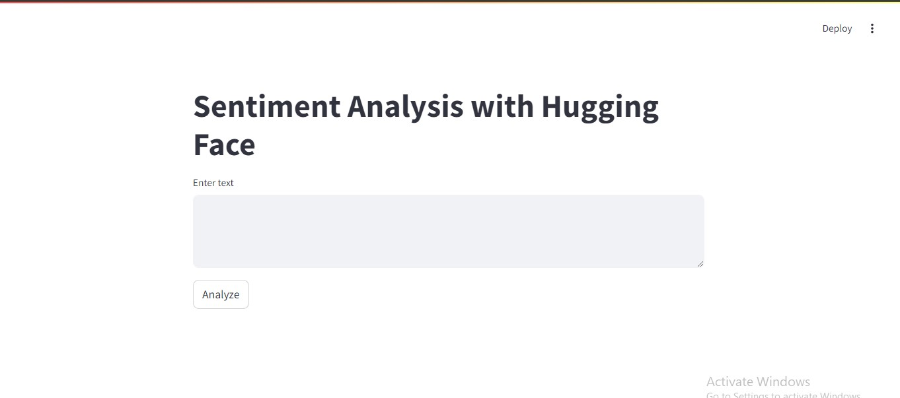
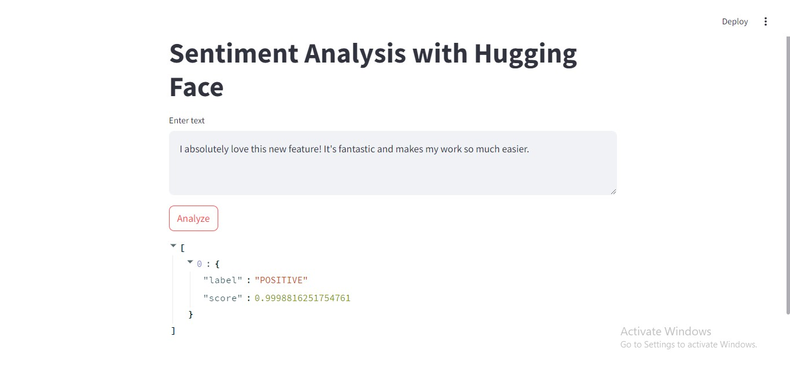
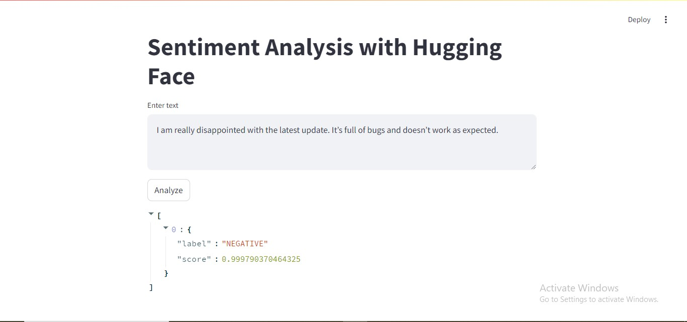

# Sentiment Analysis Project

## Overview

This project demonstrates a sentiment analysis application using Generative AI. The application leverages state-of-the-art language models to classify the sentiment of text inputs.

## Features

- **Sentiment Classification**: Classify text as positive or negative.
- **User-Friendly Interface**: Simple User interface for input and output.
- **Customizable Model**: Option to fine-tune or replace the pre-trained model for specific use cases.

## User Interface

Here’s a screenshot of the user interface for the sentiment analysis application:



## Getting Started

### Prerequisites

- Python 3.7 or higher
- `transformers` and `datasets` libraries
- `pip` for package management

### Installation

1. **Clone the repository:**

    ```bash
    git clone https://github.com/yourusername/sentiment-analysis-project.git
    cd sentiment-analysis-project
    ```

### Usage

1. **Run the sentiment analysis script:**

       ```bash
        main.py.
    ```

    ```bash
    streamlit run app.py
    ```


## Example

Here are a few example sentences you can use to test the sentiment analysis model:

- **Positive:** "I absolutely love this new feature! It's fantastic and makes my work so much easier."


- **Negative:** "I am really disappointed with the latest update. It’s full of bugs and doesn’t work as expected."


## Model Details

This project uses the [Hugging Face Transformers](https://huggingface.co/transformers/) library to leverage pre-trained models for sentiment analysis.

## Contributing

Contributions are welcome! Please open an issue or submit a pull request if you have suggestions or improvements.

## Acknowledgements

- [Hugging Face Transformers](https://huggingface.co/transformers/)
- [Sentiment Analysis Dataset](https://huggingface.co/datasets/sst2)
